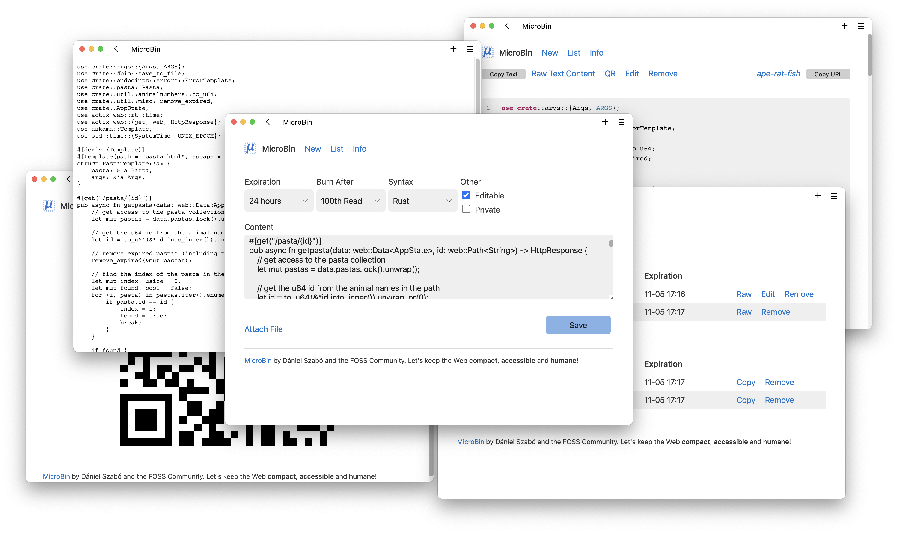

# MicroBin


[](https://crates.io/crates/microbin)
[](https://hub.docker.com/r/danielszabo99/microbin)
[](https://img.shields.io/docker/pulls/danielszabo99/microbin?label=Docker%20pulls)
[](https://discord.gg/3DsyTN7T)

MicroBin is a super tiny, feature rich, configurable, self-contained and self-hosted paste bin web application. It is very easy to set up and use, and will only require a few megabytes of memory and disk storage. It takes only a couple minutes to set it up, why not give it a try now?

### Check out the Public Test Server at [pub.microbin.eu](https://pub.microbin.eu)!

### Or host MicroBin yourself

Run our quick docker setup script ([DockerHub](https://hub.docker.com/r/danielszabo99/microbin)):
```bash
bash <(curl -s https://microbin.eu/docker.sh)
```

Or install it manually from [Cargo](https://crates.io/crates/microbin):

```bash
cargo install microbin;
curl -L -O https://raw.githubusercontent.com/szabodanika/microbin/master/.env;
source .env;
microbin
```

On our website [microbin.eu](https://microbin.eu) you will find the following:

- [Screenshots](https://microbin.eu/screenshots/)
- [Guide and Documentation](https://microbin.eu/docs/intro)
- [Donations and Sponsorships](https://microbin.eu/sponsorship)
- [Roadmap](https://microbin.eu/roadmap)

## Features

- Entirely self-contained executable, MicroBin is a single file!
- Server-side and client-side encryption
- File uploads (eg. `server.com/file/pig-dog-cat`)
- Raw text serving (eg. `server.com/raw/pig-dog-cat`)
- QR code support
- URL shortening and redirection
- Animal names instead of random numbers for upload identifiers (64 animals)
- SQLite and JSON database support
- Private and public, editable and uneditable, automatically and never expiring uploads
- Automatic dark mode and custom styling support with very little CSS and only vanilla JS (see [`water.css`](https://github.com/kognise/water.css))
- And much more!

## What is an upload?

In MicroBin, an upload can be:

- A text that you want to paste from one machine to another, eg. some code,
- A file that you want to share, eg. a video that is too large for Discord, a zip with a code project in it or an image,
- A URL redirection.

## When is MicroBin useful?

You can use MicroBin:

- To send long texts to other people,
- To send large files to other people,
- To share secrets or sensitive documents securely,
- As a URL shortener/redirect service,
- To serve content on the web, eg. configuration files for testing, images, or any other file content using the Raw functionality,
- To move files between your desktop and a server you access from the console,
- As a "postbox" service where people can upload their files or texts, but they cannot see or remove what others sent you,
- Or even to take quick notes.

...and many other things, why not get creative?

MicroBin and MicroBin.eu are available under the [BSD 3-Clause License](LICENSE).

© Dániel Szabó 2022-2023
